# python_labs

# Лабораторная работа 1
## Задание 1
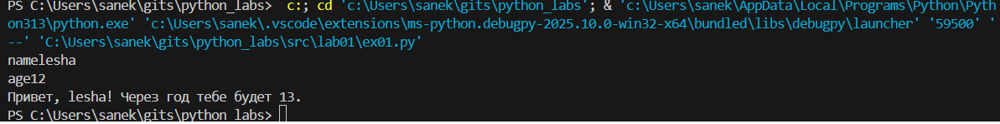
## Задание 2
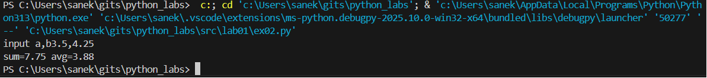
## Задание 3
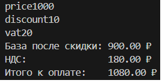
## Задание 4
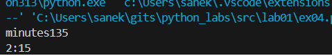
## Задание 5
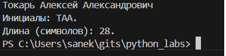
## Задание 6
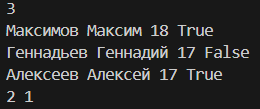
## Задание 7

# Лабораторная работа 2
## Задание 1 - Arrays
    nums=[1.0, 1, 2.5, 2.5, 0]
    def min_max(nums: list[float | int]) -> tuple[float | int, float | int]:
        if not nums:
            raise ValueError("Список не может быть пустым")
        else:
            minmax=(min(nums),max(nums))
            return minmax
    def unique_sorted(nums: list[float | int]) -> list[float | int]:
        dict_nums=dict.fromkeys(nums)
        nums_un=list(dict_nums)
        nums_un.sort()
        return nums_un
    def flatten(mat: list[list | tuple]) -> list:
        result = []
        for row in mat:
            if not isinstance(row, (list, tuple)):
                raise TypeError("Ожидался список или кортеж")
            result.extend(row)
        return result 
    
    try:      
        print(min_max(nums))
    except ValueError as e:
        print(f"Ошибка: {e}") #min_max output
    
    print(unique_sorted(nums)) #unique_sorted output
    
    try:
        print(flatten(nums))
    except TypeError as a:
        print(f"Ошибка: {a}") #flatten output
### flatten
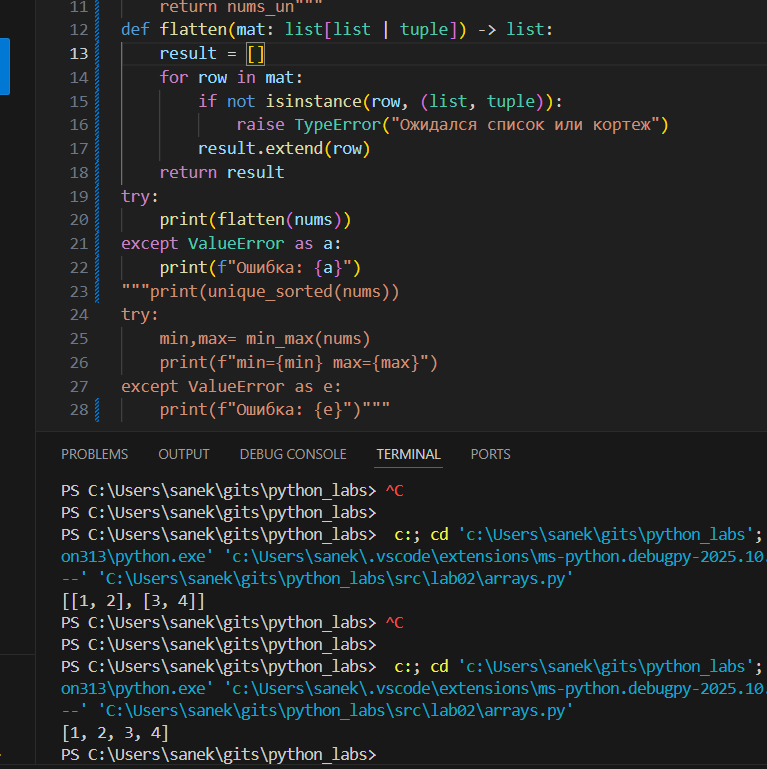

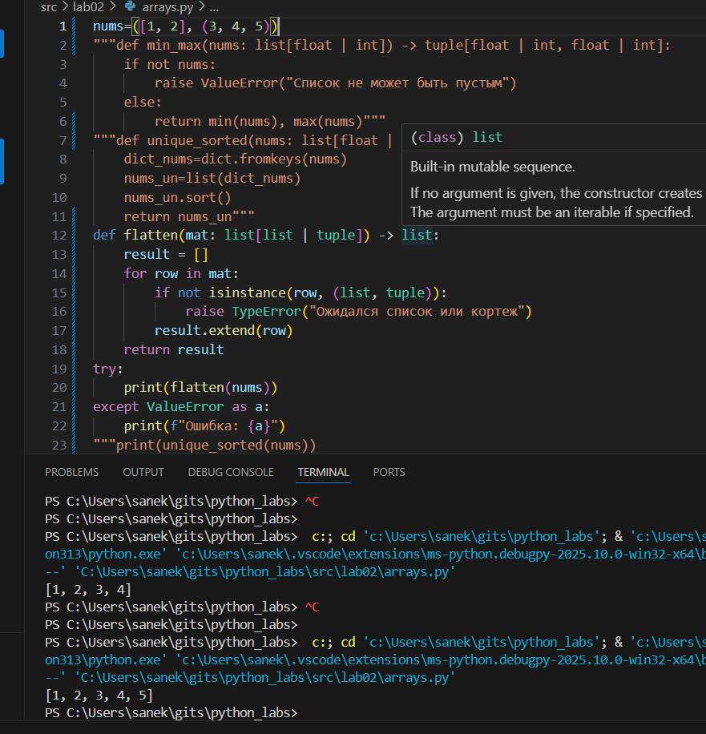

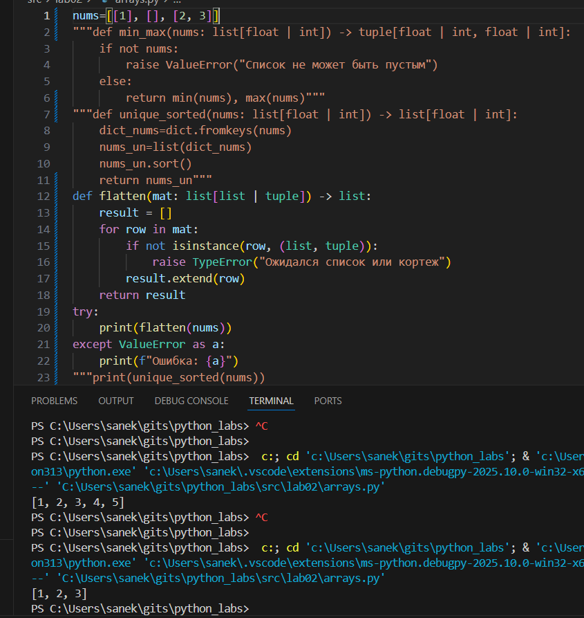

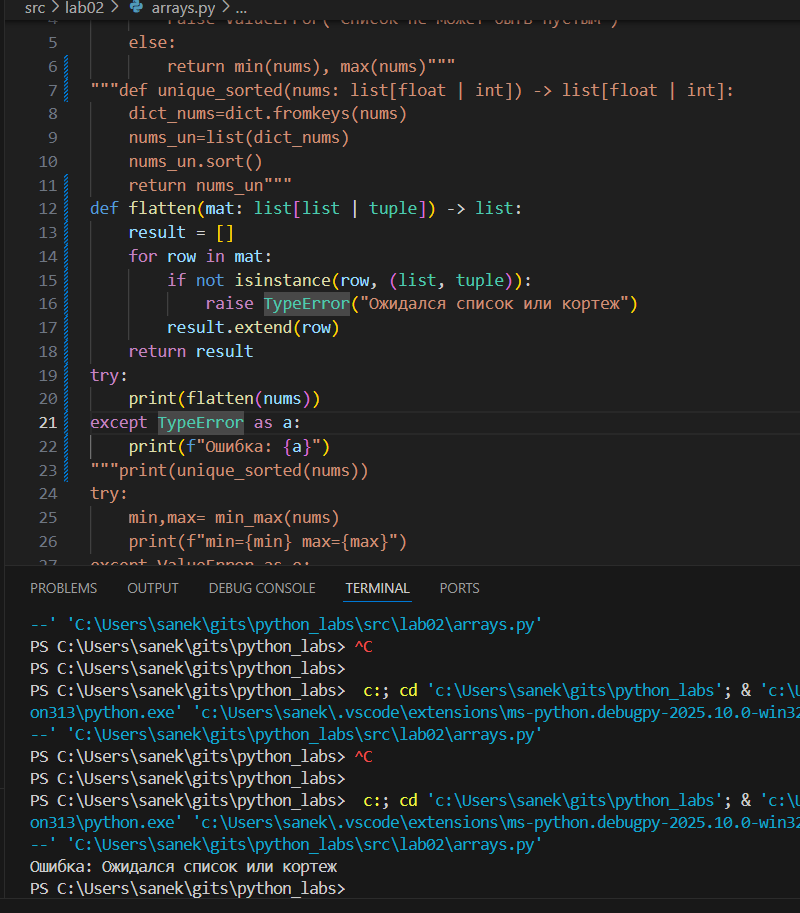
### min_max
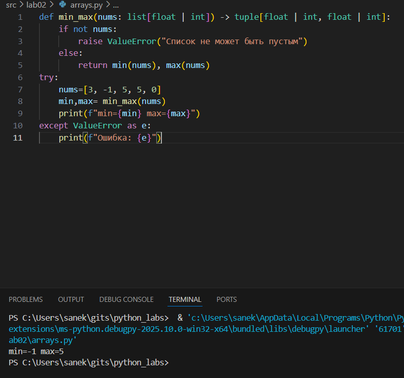

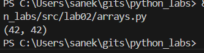

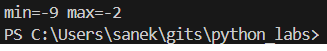

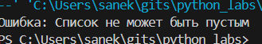

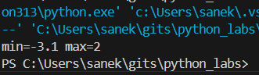
### unique_sorted
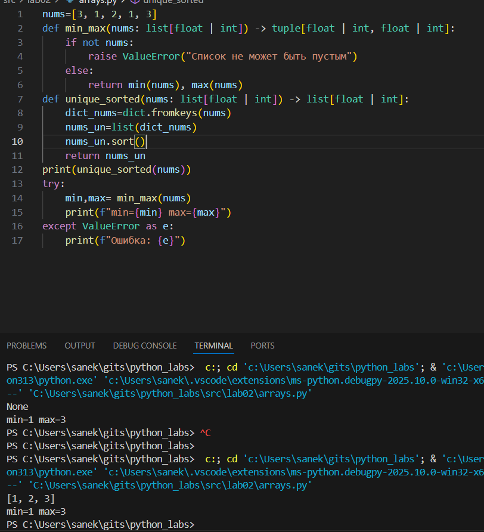

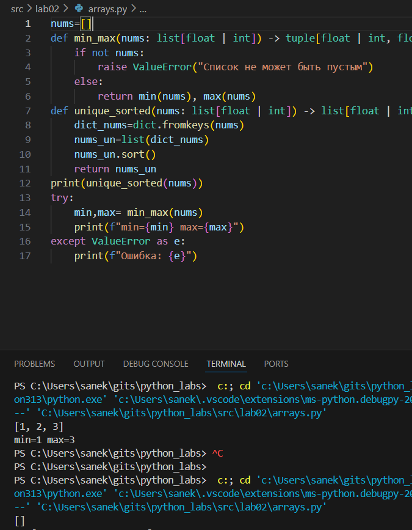

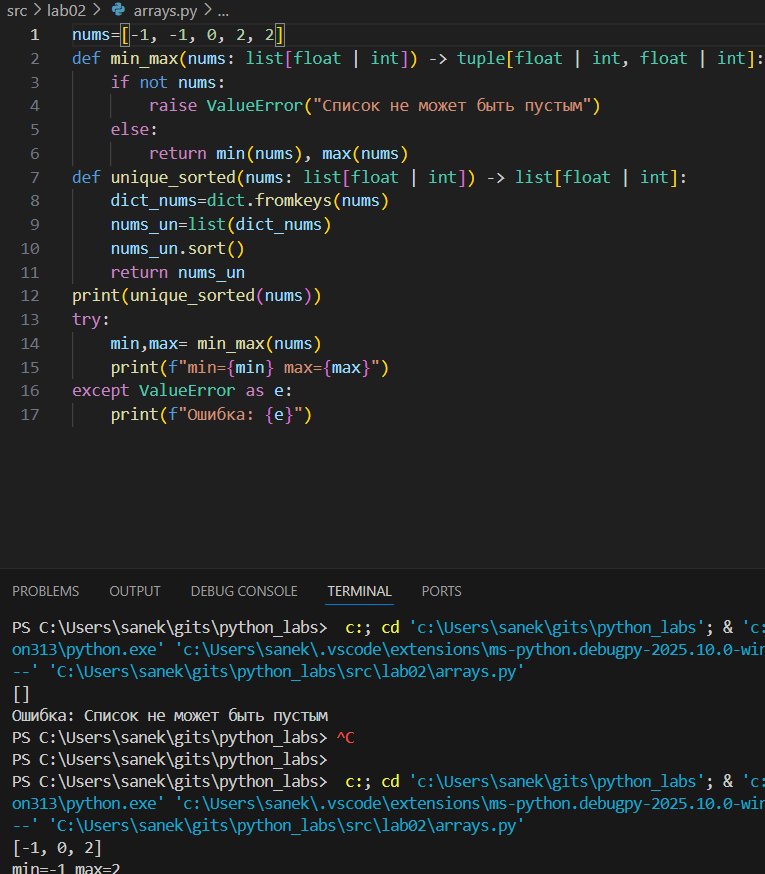

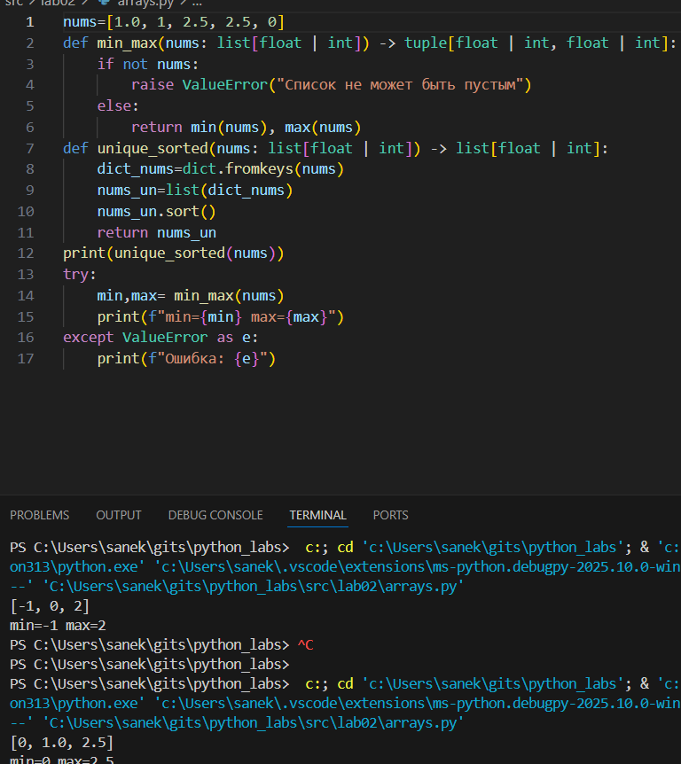
## Задание 2 - Matrix
    m=[[1, 2], [3]]
    
    def transpose(mat: list[list[float | int]]) -> list[list]:
        if not m:
            return m
        for i in range (len(m)):
            if len(m[i]) != len(m[0]):
                raise ValueError("Матрица рваная")
        transposed = list(map(list, zip(*m)))
        return transposed
    
    
    def row_sums(mat: list[list[float | int]]) -> list[float]:
        for i in range (len(m)):
            if len(m[i]) != len(m[0]):
                raise ValueError("Матрица рваная")
        rowsums = [sum(row) for row in m]
        return rowsums
    
    
    def col_sums(mat: list[list[float | int]]) -> list[float]:
        for i in range (len(m)):
            if len(m[i]) != len(m[0]):
                raise ValueError("Матрица рваная")
        colsums = []
        for j in range(len(m[0])):  
            col_sum = 0
            for i in range(len(m)):  
                col_sum += m[i][j]
            colsums.append(col_sum)
        return colsums
                
    try:
        print(transpose(m))
    except ValueError as e:
        print(f"Ошибка: {e}") #transpose output
    
    try:
        print(row_sums(m))
    except ValueError as a:
        print(f"Ошибка: {a}") #row_sums output
    
    try:
        print(col_sums(m))
    except ValueError as b:
        print(f"Ошибка: {b}") #col_sums output
### transpose
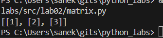

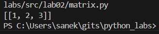

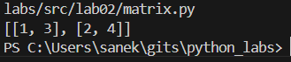

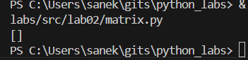

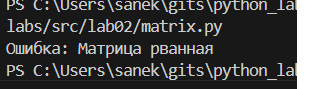
### row_sums
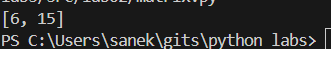

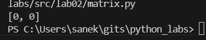

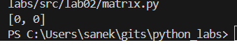

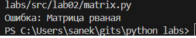
### col_sums
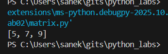

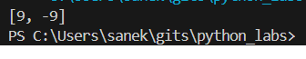

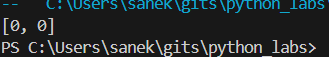

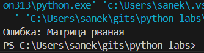
## Задание 3 - Tuples
        def format_record(rec: tuple[str, str, float]) -> str:
            if not isinstance(rec[0], str) or not isinstance(rec[1], str) or not isinstance(rec[2], (int, float)):
                raise TypeError("Неверные типы данных в записи")
            
            fio, group, gpa = rec
            
            if not fio.strip():
                raise ValueError("ФИО не может быть пустым")
            if not group.strip():
                raise ValueError("Группа не может быть пустой")
            if gpa < 0:
                raise ValueError("GPA не может быть отрицательным")
            
            fio_parts = ' '.join(fio.split()).title().split()
            
            initials = []
            for part in fio_parts[1:]:  
                if part:  
                    initials.append(part[0].upper() + '.')
            
            formatted_fio = f"{fio_parts[0]} {' '.join(initials)}"
            
            formatted_gpa = f"{gpa:.2f}"
            
            return f"{formatted_fio}, гр. {group.strip()}, GPA {formatted_gpa}"
        
        test_cases = [
            ("Иванов Иван Иванович", "BIVT-25", 4.6),
            ("Петров Пётр", "IKBO-12", 5.0),
            ("Петров Пётр Петрович", "IKBO-12", 5.0),
            ("  сидорова  анна   сергеевна ", "ABB-01", 3.999),
        ]
        
        print("Тест-кейсы:")
        for i, test_case in enumerate(test_cases, 1):
            try:
                result = format_record(test_case)
                print(f"{i}. {result}")
            except (ValueError, TypeError) as e:
                print(f"{i}. Ошибка: {e}")
        
        print("\nНекорректные записи:")
        invalid_cases = [
            ("", "BIVT-25", 4.6),  
            ("Иванов Иван", "", 4.6),  
            ("Иванов Иван", "BIVT-25", -1.0),  
            ("Иванов Иван", "BIVT-25", "4.6"),  
        ]
        
        for i, test_case in enumerate(invalid_cases, 1):
            try:
                result = format_record(test_case)
                print(f"{i}. {result}")
            except (ValueError, TypeError) as e:
                print(f"{i}. Ошибка: {e}")
    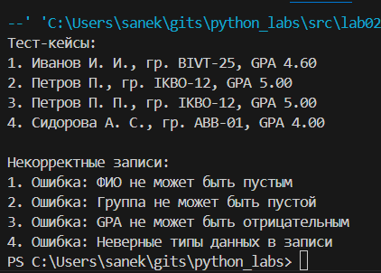
# Лабораторная работа 3
## Задание A
    import re
    from typing import Dict, List, Tuple
    
    
    def normalize(text: str, *, casefold: bool = True, yo2e: bool = True) -> str:
        if not text:
            return ""
        result = text
        if yo2e:
            result = result.replace('ё', 'е').replace('Ё', 'Е')
        if casefold:
            result = result.casefold()
        control_chars = ['\t', '\r', '\n']
        for char in control_chars:
            result = result.replace(char, ' ')
        result = re.sub(r'\s+', ' ', result).strip()
    
        return result
    
    
    def tokenize(text: str) -> List[str]:
        if not text:
            return []
        pattern = r'\w+(?:-\w+)*'
        tokens = re.findall(pattern, text)
        return tokens
    
    def count_freq(tokens: List[str]) -> Dict[str, int]:
        freq_dict = {}
        for token in tokens:
            freq_dict[token] = freq_dict.get(token, 0) + 1
        
        return freq_dict
    
    
    def top_n(freq: Dict[str, int], n: int = 5) -> List[Tuple[str, int]]:
        if not freq:
            return []
        items = list(freq.items())
        sorted_items = sorted(items, key=lambda x: (-x[1], x[0]))
        return sorted_items[:n]
    """
    # Тесты для normalize
    print("=== normalize ===")
    print(repr(normalize("ПрИвЕт\nМИр\t")))  
    print(repr(normalize("ёжик, Ёлка", yo2e=True)))  
    print(repr(normalize("Hello\r\nWorld")))  
    print(repr(normalize("  двойные   пробелы  ")))  
    
    # Тесты для tokenize
    print("\n=== tokenize ===")
    print(tokenize("привет мир"))  
    print(tokenize("hello,world!!!"))  
    print(tokenize("по-настоящему круто"))  
    print(tokenize("2025 год"))  
    print(tokenize("emoji 😀 не слово"))  
    
    # Тесты для count_freq + top_n
    print("\n=== count_freq + top_n ===")
    tokens1 = ["a", "b", "a", "c", "b", "a"]
    freq1 = count_freq(tokens1)
    print(freq1)  
    print(top_n(freq1, 2))  
    
    tokens2 = ["bb", "aa", "bb", "aa", "cc"]
    freq2 = count_freq(tokens2)
    print(freq2)  
    print(top_n(freq2, 2))  
    """
    
    
    """
    # ТЕСТЫ ДЛЯ ЗАДАНИЯ A
    if __name__ == "__main__":
        # normalize
        assert normalize("ПрИвЕт\nМИр\t") == "привет мир"
        assert normalize("ёжик, Ёлка") == "ежик, елка"
        
        # tokenize
        assert tokenize("привет, мир!") == ["привет", "мир"]
        assert tokenize("по-настоящему круто") == ["по-настоящему", "круто"]
        assert tokenize("2025 год") == ["2025", "год"]
        
        # count_freq + top_n
        freq = count_freq(["a","b","a","c","b","a"])
        assert freq == {"a":3, "b":2, "c":1}
        assert top_n(freq, 2) == [("a",3), ("b",2)]
        
        # тай-брейк по слову при равной частоте
        freq2 = count_freq(["bb","aa","bb","aa","cc"])
        assert top_n(freq2, 2) == [("aa",2), ("bb",2)]
        
        print("✅ Все тесты прошли успешно!")
        """
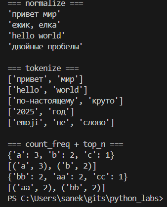
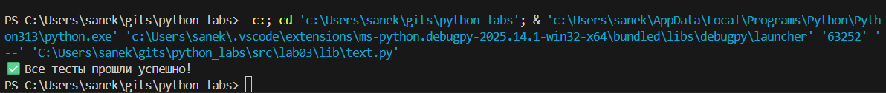
## Задание В
    #!/usr/bin/env python3
    import sys
    import os
    sys.path.insert(0, os.path.dirname(__file__))
    from lib.text import normalize, tokenize, count_freq, top_n
    
    text = sys.stdin.read().strip()
    if not text: 
        print("No input")
        sys.exit()
    
    normalized = normalize(text)
    tokens = tokenize(normalized)
    freq = count_freq(tokens)
    top_words = top_n(freq, 5)
    
    print(f"Всего слов: {len(tokens)}")
    print(f"Уникальных слов: {len(freq)}")
    print("Топ-5:")
    for word, count in top_words:
        print(f"{word}:{count}")
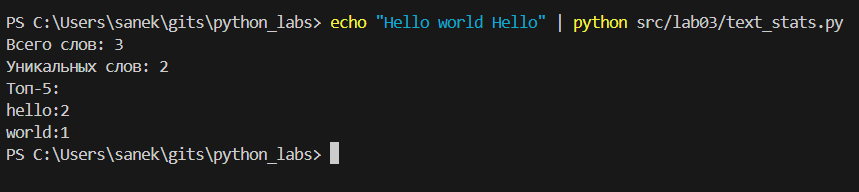
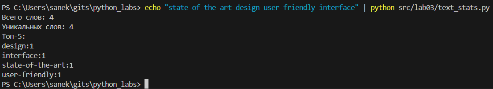
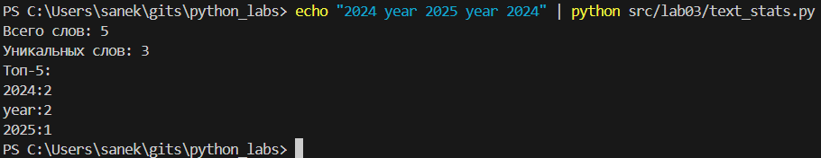
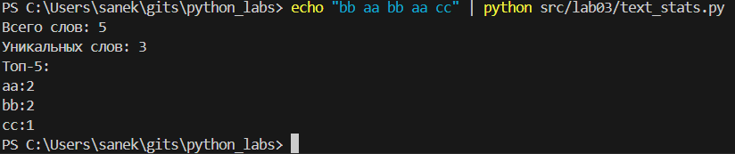
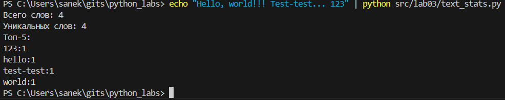
### Тестовые для 2 задания в баш
    echo "Hello world Hello" | python src/lab03/text_stats.py
    echo "state-of-the-art design user-friendly interface" | python src/lab03/text_stats.py
    echo "2024 year 2025 year 2024" | python src/lab03/text_stats.py
    echo "bb aa bb aa cc" | python src/lab03/text_stats.py
    echo "Hello, world!!! Test-test... 123" | python src/lab03/text_stats.py
# Лабораторная работа 4
## Задание A
    from pathlib import Path
    import csv
    
    
    def read_text(path: str | Path, encoding: str = "utf-8") -> str:
        '''
        Открывает текстовый файл и возвращает его содержимое как одну строку.
    
        По умолчанию используется кодировка UTF-8.
        При необходимости можно указать другую, например encoding="cp1251".
        '''
        path = Path(path)
        with path.open('r', encoding=encoding) as file:
            return file.read()  
    
    
    def ensure_parent_dir(path: str | Path) -> None:
        '''
        Создаёт родительские директории для указанного пути, если их нет.
    
        Полезно перед записью файла, чтобы избежать ошибки FileNotFoundError.
        '''
        path = Path(path)
        parent = path.parent
        if not parent.exists():
            parent.mkdir(parents=True, exist_ok=True)
    
    
    def write_csv(rows: list[tuple | list], path: str | Path, header: tuple[str, ...] | None = None) -> None:
        '''
        Создаёт или перезаписывает CSV-файл с разделителем ','.
    
        Если указан header, записывает его первой строкой.
        Проверяет, что все строки в 'rows' имеют одинаковую длину.
        '''
        if not rows:
            raise ValueError("Список строк 'rows' не может быть пустым.")
    
        row_lengths = {len(r) for r in rows}
        if len(row_lengths) > 1:
            raise ValueError("Все строки в 'rows' должны быть одинаковой длины.")
    
        ensure_parent_dir(path)
    
        path = Path(path)
        with path.open("w", newline="", encoding="utf-8") as file:
            writer = csv.writer(file, delimiter=",")
            if header:
                writer.writerow(header)
            writer.writerows(rows)
    
    
    input_path = Path("data/input.txt")
    
    try:
        content = read_text(input_path, encoding="utf-8")
        print("Содержимое файла input.txt:\n", content)
    except FileNotFoundError:
        print("Файл не найден!")
    except UnicodeDecodeError:
        print("Ошибка кодировки! Попробуйте encoding='cp1251'.")
    
    
    rows = [
        (1, 'Петя', 17),
        (2, 'Ваня', 18),
        (3, 'Егор', 17)
    ]
    write_csv(rows, "output/users.csv", header=("ID", "Name", "Age"))
    
    print("\n Файл 'output/users.csv' успешно создан!")
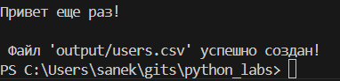

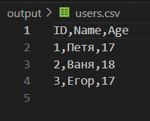

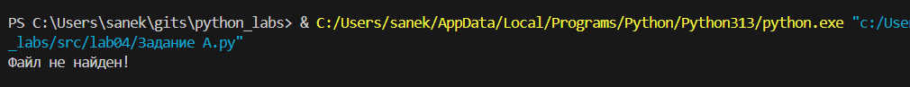
## Задание B
    import sys
    import os
    from pathlib import Path
    
    # Добавляем путь к папке lib
    project_root = Path(__file__).parent.parent.parent.parent
    lib_path = project_root / "lib"
    sys.path.insert(0, str(lib_path))
    
    try:
        from lib.text import tokenize, count_freg, top_n, normalize
    except ImportError as e:
        print(f"Ошибка импорта: {e}")
        print("Убедитесь, что файл lib/text.py существует")
        sys.exit(1)
    
    import csv
    
    table = True
    
    def print_table(top: list[tuple]):
        if not top:
            print('Нет слов для отображения')
            return
        max_len = max(len(word) for word, _ in top)
        col_word = 'слово'
        col_freq = 'частота'
    
        width_word = max(max_len, len(col_word))
        width_freq = len(col_freq)
        print(f"{col_word:<{width_word}} | {col_freq}")
        print("-" * width_word + "-+-" + "-" * width_freq)
    
        for word, count in top:
            print(f"{word:<{width_word}} | {count}")
    
    
    def main():
        # Ищем файл в корневой папке data/input.txt
        input_path = Path(__file__).parent.parent.parent.parent / "data" / "input.txt"     
        output_path = Path(__file__).parent.parent.parent.parent / "data" / "report.csv"   
    
        if not input_path.exists():
            print(f"Файл {input_path} не найден!")
            sys.exit(1)
    
        try:
            text = input_path.read_text(encoding="utf-8")
        except UnicodeDecodeError as e:
            print(f"Ошибка кодировки при чтении {input_path}: {e}")
            sys.exit(1) 
    
        text = normalize(text)
        tokens = tokenize(text)
        freq = count_freg(tokens)
    
        def sort_key(item):
            word, count = item
            return (-count, word)
    
        sorted_items = sorted(freq.items(), key=sort_key)
         
         
        output_path.parent.mkdir(parents=True, exist_ok=True)  
        with output_path.open("w", newline="", encoding="utf-8") as file: 
            writer = csv.writer(file) 
            writer.writerow(["word", "count"]) 
            writer.writerows(sorted_items)
        
        total_words = sum(freq.values())
        unique_words = len(freq)
        top5 = top_n(freq, n=5)
    
        print(f"Всего слов: {total_words}")
        print(f"Уникальных слов: {unique_words}")
        print(f"Топ: {top5}")
    
        if table:
            print("\nТаблица топ слов:")
            print_table(top5)
    
    if __name__ == "__main__":
        main()
# Лабораторная работа 5
## Задание A
```python
import json
import csv
from pathlib import Path


def json_to_csv(json_path: str, csv_path: str) -> None:
    """
    Преобразует JSON-файл в CSV.
    Поддерживает список словарей [{...}, {...}], заполняет отсутствующие поля пустыми строками.
    Кодировка UTF-8. Порядок колонок — алфавитный.
    """
    json_file = Path(json_path)
    if not json_file.exists():
        raise FileNotFoundError(f"JSON файл не найден: {json_path}")
    
    if not json_file.suffix.lower() == '.json':
        raise ValueError(f"Неверный тип файла: ожидается .json, получен {json_file.suffix}")
    
    try:
        with json_file.open('r', encoding='utf-8') as f:
            data = json.load(f)
    except json.JSONDecodeError as e:
        raise ValueError(f"Ошибка парсинга JSON: {e}")
    
    if not data:
        raise ValueError("Пустой JSON или неподдерживаемая структура")
    
    if not isinstance(data, list):
        raise ValueError("JSON должен содержать список объектов")
    
    if not all(isinstance(item, dict) for item in data):
        raise ValueError("Все элементы JSON должны быть словарями")
    
    if not data:
        raise ValueError("Пустой список в JSON")
    
    # Собираем все возможные поля из всех объектов (алфавитный порядок)
    all_fields = set()
    for item in data:
        all_fields.update(item.keys())
    fieldnames = sorted(all_fields)
    
    csv_file = Path(csv_path)
    csv_file.parent.mkdir(parents=True, exist_ok=True)
    
    with csv_file.open('w', newline='', encoding='utf-8') as f:
        writer = csv.DictWriter(f, fieldnames=fieldnames)
        writer.writeheader()
        for row in data:
            # Заполняем отсутствующие поля пустыми строками
            complete_row = {field: row.get(field, '') for field in fieldnames}
            writer.writerow(complete_row)


def csv_to_json(csv_path: str, json_path: str) -> None:
    """
    Преобразует CSV в JSON (список словарей).
    Заголовок обязателен, значения сохраняются как строки.
    """
    csv_file = Path(csv_path)
    if not csv_file.exists():
        raise FileNotFoundError(f"CSV файл не найден: {csv_path}")
    
    if not csv_file.suffix.lower() == '.csv':
        raise ValueError(f"Неверный тип файла: ожидается .csv, получен {csv_file.suffix}")
    
    try:
        with csv_file.open('r', encoding='utf-8') as f:
            reader = csv.DictReader(f)
            rows = list(reader)
    except Exception as e:
        raise ValueError(f"Ошибка чтения CSV: {e}")
    
    if not rows:
        raise ValueError("Пустой CSV файл")
    
    json_file = Path(json_path)
    json_file.parent.mkdir(parents=True, exist_ok=True)
    
    with json_file.open('w', encoding='utf-8') as f:
        json.dump(rows, f, ensure_ascii=False, indent=2)
```
## Задание B
```python
import csv
from pathlib import Path
try:
    from openpyxl import Workbook
except ImportError:
    raise ImportError("Для работы модуля требуется установить openpyxl: pip install openpyxl")


def csv_to_xlsx(csv_path: str, xlsx_path: str) -> None:
    """
    Конвертирует CSV в XLSX.
    Использовать openpyxl.
    Первая строка CSV — заголовок.
    Лист называется "Sheet1".
    Колонки — автоширина по длине текста (не менее 8 символов).
    """
    csv_file = Path(csv_path)
    if not csv_file.exists():
        raise FileNotFoundError(f"CSV файл не найден: {csv_path}")
    
    if not csv_file.suffix.lower() == '.csv':
        raise ValueError(f"Неверный тип файла: ожидается .csv, получен {csv_file.suffix}")
    
    try:
        with csv_file.open('r', encoding='utf-8') as f:
            reader = csv.reader(f)
            rows = list(reader)
    except Exception as e:
        raise ValueError(f"Ошибка чтения CSV: {e}")
    
    if not rows:
        raise ValueError("Пустой CSV файл")
    
    # Создаем новую книгу Excel
    wb = Workbook()
    ws = wb.active
    ws.title = "Sheet1"
    
    # Записываем данные
    for row in rows:
        ws.append(row)
    
    # Настраиваем автоширину колонок (не менее 8 символов)
    for column in ws.columns:
        max_length = 0
        column_letter = column[0].column_letter
        for cell in column:
            try:
                if len(str(cell.value)) > max_length:
                    max_length = len(str(cell.value))
            except:
                pass
        adjusted_width = max(max_length + 2, 8)  # Минимум 8 символов
        ws.column_dimensions[column_letter].width = adjusted_width
    
    # Сохраняем файл
    xlsx_file = Path(xlsx_path)
    xlsx_file.parent.mkdir(parents=True, exist_ok=True)
    wb.save(xlsx_file)
```
## Demo файл
```python
import sys
from pathlib import Path

# Добавляем путь к модулям
sys.path.append(str(Path(__file__).parent / 'src'))

from lab05.json_csv import json_to_csv, csv_to_json
from lab05.csv_xlsx import csv_to_xlsx

def main():
    print("Демонстрация работы модулей lab05")
    
    # Создаем директории для выходных файлов
    output_dir = Path("data/out")
    output_dir.mkdir(parents=True, exist_ok=True)
    
    try:
        # 1. JSON → CSV
        print("\n1. Конвертация JSON → CSV:")
        json_to_csv("data/samples/people.json", "data/out/people_from_json.csv")
        print(" Успешно: data/out/people_from_json.csv")
        
        # 2. CSV → JSON
        print("\n2. Конвертация CSV → JSON:")
        csv_to_json("data/samples/people.csv", "data/out/people_from_csv.json")
        print(" Успешно: data/out/people_from_csv.json")
        
        # 3. CSV → XLSX
        print("\n3. Конвертация CSV → XLSX:")
        csv_to_xlsx("data/samples/cities.csv", "data/out/cities.xlsx")
        print(" Успешно: data/out/cities.xlsx")
        
        # 4. Обратная проверка: JSON → CSV → JSON
        print("\n4. Обратная проверка JSON → CSV → JSON:")
        json_to_csv("data/out/people_from_csv.json", "data/out/people_roundtrip.csv")
        csv_to_json("data/out/people_roundtrip.csv", "data/out/people_roundtrip.json")
        print(" Успешно: data/out/people_roundtrip.json")
        
        print("\n Все операции выполнены успешно!")
        
    except Exception as e:
        print(f" Ошибка: {e}")

if __name__ == "__main__":
    main()
```
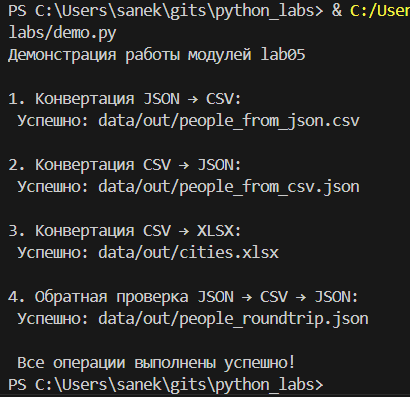

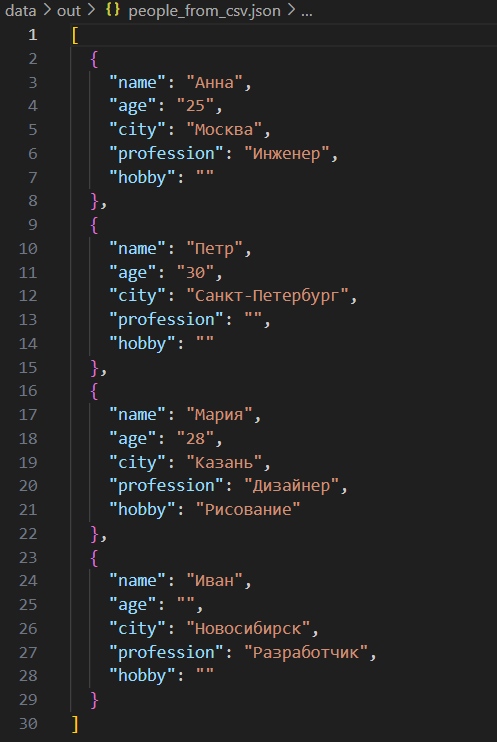

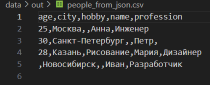

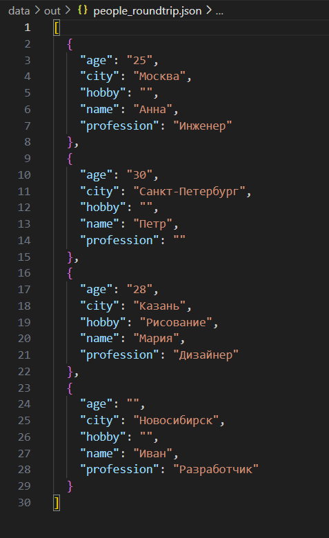

# Лабораторная работа 6
## cli_convert.py
```python
"""
Вспомогательные функции для ввода/вывода
"""

import json
import csv

def read_file(file_path):
    """Чтение файла с автоматическим определением кодировки"""
    encodings = ['utf-8', 'cp1251', 'iso-8859-1']
    
    for encoding in encodings:
        try:
            with open(file_path, 'r', encoding=encoding) as file:
                return file.read()
        except UnicodeDecodeError:
            continue
            
    raise UnicodeDecodeError(f"Не удалось декодировать файл {file_path} с помощью кодировок: {encodings}")

def write_file(file_path, content):
    """Запись в файл в кодировке UTF-8"""
    with open(file_path, 'w', encoding='utf-8') as file:
        file.write(content)

def read_json(file_path):
    """Чтение JSON файла"""
    with open(file_path, 'r', encoding='utf-8') as file:
        return json.load(file)

def write_json(file_path, data):
    """Запись данных в JSON файл"""
    with open(file_path, 'w', encoding='utf-8') as file:
        json.dump(data, file, ensure_ascii=False, indent=2)

def read_csv(file_path):
    """Чтение CSV файла"""
    with open(file_path, 'r', encoding='utf-8') as file:
        return list(csv.reader(file))

def write_csv(file_path, data):
    """Запись данных в CSV файл"""
    with open(file_path, 'w', encoding='utf-8', newline='') as file:
        writer = csv.writer(file)
        writer.writerows(data)
```
## cli_text.py
```python
#!/usr/bin/env python3
"""
CLI-утилиты для работы с текстом
"""

import argparse
import sys
import re
from collections import Counter

def read_file(file_path):
    """
    Чтение файла с автоматическим определением кодировки
    """
    encodings = ['utf-8', 'cp1251', 'iso-8859-1', 'windows-1251']
    
    for encoding in encodings:
        try:
            with open(file_path, 'r', encoding=encoding) as file:
                return file.read()
        except UnicodeDecodeError:
            continue
            
    raise UnicodeDecodeError(f"Не удалось декодировать файл {file_path}")

def calculate_word_frequency(text):
    """
    Анализ частотности слов в тексте
    """
    # Приводим к нижнему регистру и находим слова
    words = re.findall(r'\b[а-яёa-z]+\b', text.lower())
    return Counter(words)

def get_top_words(frequency, top_n=5):
    """
    Получение топ-N самых частых слов
    """
    return frequency.most_common(top_n)

def cat_command(input_file, number_lines=False):
    """
    Реализация команды cat - вывод содержимого файла
    """
    try:
        content = read_file(input_file)
        lines = content.split('\n')
        
        for i, line in enumerate(lines, 1):
            if number_lines:
                print(f"{i:6d}\t{line}")
            else:
                print(line)
                
    except FileNotFoundError:
        print(f"Ошибка: файл '{input_file}' не найден")
        sys.exit(1)
    except Exception as e:
        print(f"Ошибка при чтении файла: {e}")
        sys.exit(1)

def stats_command(input_file, top_n=5):
    """
    Реализация команды stats - анализ частот слов
    """
    try:
        content = read_file(input_file)
        if not content.strip():
            print("Файл пуст")
            return
            
        frequency = calculate_word_frequency(content)
        top_words = get_top_words(frequency, top_n)
        
        print(f"Топ-{top_n} самых частых слов в файле '{input_file}':")
        print("-" * 40)
        for i, (word, count) in enumerate(top_words, 1):
            print(f"{i:2d}. {word:<15} {count:>4} раз")
            
    except FileNotFoundError:
        print(f"Ошибка: файл '{input_file}' не найден")
        sys.exit(1)
    except Exception as e:
        print(f"Ошибка при анализе текста: {e}")
        sys.exit(1)

def main():
    parser = argparse.ArgumentParser(
        description="CLI-утилиты для работы с текстом",
        formatter_class=argparse.RawDescriptionHelpFormatter
    )
    subparsers = parser.add_subparsers(dest="command", help="Доступные команды")

    # Подкоманда cat
    cat_parser = subparsers.add_parser("cat", help="Вывести содержимое файла")
    cat_parser.add_argument("--input", required=True, help="Входной файл")
    cat_parser.add_argument("-n", action="store_true", help="Нумеровать строки")

    # Подкоманда stats
    stats_parser = subparsers.add_parser("stats", help="Анализ частот слов")
    stats_parser.add_argument("--input", required=True, help="Входной текстовый файл")
    stats_parser.add_argument("--top", type=int, default=5, help="Количество топ-слов (по умолчанию: 5)")

    args = parser.parse_args()

    if args.command == "cat":
        cat_command(args.input, args.n)
    elif args.command == "stats":
        stats_command(args.input, args.top)
    else:
        parser.print_help()

if __name__ == "__main__":
    main()
```
## io_helpers.py
```python
"""
Вспомогательные функции для ввода/вывода
"""

import json
import csv

def read_file(file_path):
    """Чтение файла с автоматическим определением кодировки"""
    encodings = ['utf-8', 'cp1251', 'iso-8859-1']
    
    for encoding in encodings:
        try:
            with open(file_path, 'r', encoding=encoding) as file:
                return file.read()
        except UnicodeDecodeError:
            continue
            
    raise UnicodeDecodeError(f"Не удалось декодировать файл {file_path} с помощью кодировок: {encodings}")

def write_file(file_path, content):
    """Запись в файл в кодировке UTF-8"""
    with open(file_path, 'w', encoding='utf-8') as file:
        file.write(content)

def read_json(file_path):
    """Чтение JSON файла"""
    with open(file_path, 'r', encoding='utf-8') as file:
        return json.load(file)

def write_json(file_path, data):
    """Запись данных в JSON файл"""
    with open(file_path, 'w', encoding='utf-8') as file:
        json.dump(data, file, ensure_ascii=False, indent=2)

def read_csv(file_path):
    """Чтение CSV файла"""
    with open(file_path, 'r', encoding='utf-8') as file:
        return list(csv.reader(file))

def write_csv(file_path, data):
    """Запись данных в CSV файл"""
    with open(file_path, 'w', encoding='utf-8', newline='') as file:
        writer = csv.writer(file)
        writer.writerows(data)
```
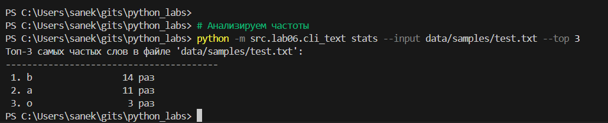

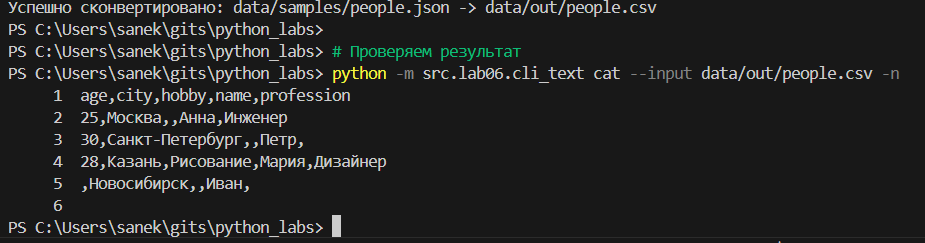

# Лабораторная работа 7
## tests/test_text.py
```python
import pytest
from src.lib.text import normalize, tokenize, count_freq, top_n


class TestNormalize:
    """Тесты для функции normalize"""

    @pytest.mark.parametrize(
        "source, expected",
        [
            ("ПрИвЕт\nМИр\t", "привет мир"),
            ("ёжик, Ёлка", "ежик, елка"),
            ("Hello\r\nWorld", "hello world"),
            ("  двойные   пробелы  ", "двойные пробелы"),
            ("", ""),
            ("   ", ""),
            ("ТЕСТ", "тест"),
            ("много\t\t\tтабов", "много табов"),
        ],
    )
    def test_normalize_basic(self, source, expected):
        assert normalize(source) == expected


class TestTokenize:
    """Тесты для функции tokenize"""

    @pytest.mark.parametrize(
        "source, expected",
        [
            ("привет мир", ["привет", "мир"]),
            ("hello world test", ["hello", "world", "test"]),
            ("", []),
            ("   ", []),
            ("только, пунктуация!?", []),
            ("смешанный text с English", ["смешанный", "text", "с", "english"]),
            ("много     пробелов", ["много", "пробелов"]),
        ],
    )
    def test_tokenize_basic(self, source, expected):
        assert tokenize(source) == expected


class TestCountFreq:
    """Тесты для функции count_freq"""

    def test_count_freq_basic(self):
        tokens = ["apple", "banana", "apple", "cherry", "banana", "apple"]
        expected = {"apple": 3, "banana": 2, "cherry": 1}
        assert count_freq(tokens) == expected

    def test_count_freq_empty(self):
        assert count_freq([]) == {}

    def test_count_freq_single(self):
        assert count_freq(["test"]) == {"test": 1}

    def test_count_freq_duplicates(self):
        tokens = ["word", "word", "word"]
        assert count_freq(tokens) == {"word": 3}


class TestTopN:
    """Тесты для функции top_n"""

    def test_top_n_basic(self):
        freq = {"apple": 5, "banana": 3, "cherry": 7, "date": 1}
        result = top_n(freq, 3)
        expected = [("cherry", 7), ("apple", 5), ("banana", 3)]
        assert result == expected

    def test_top_n_tie_breaker(self):
        # Проверка сортировки по алфавиту при равных частотах
        freq = {"zebra": 3, "apple": 3, "banana": 3, "cherry": 2}
        result = top_n(freq, 4)
        expected = [("apple", 3), ("banana", 3), ("zebra", 3), ("cherry", 2)]
        assert result == expected

    def test_top_n_empty(self):
        assert top_n({}, 5) == []

    def test_top_n_zero_n(self):
        assert top_n({"a": 1}, 0) == []

    def test_top_n_more_than_available(self):
        freq = {"a": 1, "b": 2}
        result = top_n(freq, 5)
        assert len(result) == 2
        assert result == [("b", 2), ("a", 1)]

    def test_top_n_single(self):
        assert top_n({"test": 5}, 1) == [("test", 5)]
```
## tests/test_json_csv.py
```python
import pytest
import json
import csv
from pathlib import Path
from src.lab05.json_csv import json_to_csv, csv_to_json


class TestJsonToCsv:
    """Тесты для функции json_to_csv"""

    def test_json_to_csv_basic(self, tmp_path: Path):
        """Позитивный тест конвертации JSON в CSV"""
        src = tmp_path / "test.json"
        dst = tmp_path / "test.csv"

        data = [
            {"name": "Alice", "age": 22, "city": "Moscow"},
            {"name": "Bob", "age": 25, "city": "SPb"},
            {"name": "Charlie", "age": 30},
        ]

        src.write_text(json.dumps(data, ensure_ascii=False, indent=2), encoding="utf-8")
        json_to_csv(str(src), str(dst))

        # Проверяем что файл создан
        assert dst.exists()

        # Проверяем содержимое CSV
        with open(dst, "r", encoding="utf-8") as f:
            reader = csv.DictReader(f)
            rows = list(reader)

        assert len(rows) == 3
        assert set(rows[0].keys()) == {"age", "city", "name"}
        assert rows[0]["name"] == "Alice"
        assert rows[0]["age"] == "22"
        assert rows[0]["city"] == "Moscow"

    def test_json_to_csv_roundtrip(self, tmp_path: Path):
        """Тест полного цикла JSON -> CSV -> JSON"""
        src_json = tmp_path / "src.json"
        intermediate_csv = tmp_path / "intermediate.csv"
        dst_json = tmp_path / "dst.json"

        original_data = [{"id": 1, "value": "test1"}, {"id": 2, "value": "test2"}]

        # Сохраняем исходный JSON
        src_json.write_text(json.dumps(original_data), encoding="utf-8")

        # Конвертируем в CSV
        json_to_csv(str(src_json), str(intermediate_csv))

        # Конвертируем обратно в JSON
        csv_to_json(str(intermediate_csv), str(dst_json))

        # Читаем результат
        with open(dst_json, "r", encoding="utf-8") as f:
            result_data = json.load(f)

        # Проверяем что данные сохранились
        assert len(result_data) == len(original_data)
        assert result_data[0]["id"] == "1"  # CSV конвертирует числа в строки
        assert result_data[0]["value"] == "test1"

    def test_json_to_csv_file_not_found(self):
        """Тест на несуществующий файл"""
        with pytest.raises(FileNotFoundError):
            json_to_csv("nonexistent.json", "output.csv")

    def test_json_to_csv_invalid_json(self, tmp_path: Path):
        """Тест на некорректный JSON"""
        src = tmp_path / "invalid.json"
        dst = tmp_path / "output.csv"

        src.write_text("{invalid json}", encoding="utf-8")

        with pytest.raises(ValueError):
            json_to_csv(str(src), str(dst))

    def test_json_to_csv_empty_json(self, tmp_path: Path):
        """Тест на пустой JSON"""
        src = tmp_path / "empty.json"
        dst = tmp_path / "output.csv"

        src.write_text("[]", encoding="utf-8")

        with pytest.raises(ValueError):
            json_to_csv(str(src), str(dst))

    def test_json_to_csv_not_array(self, tmp_path: Path):
        """Тест на JSON не являющийся массивом объектов"""
        src = tmp_path / "not_array.json"
        dst = tmp_path / "output.csv"

        src.write_text('{"key": "value"}', encoding="utf-8")

        with pytest.raises(ValueError):
            json_to_csv(str(src), str(dst))


class TestCsvToJson:
    """Тесты для функции csv_to_json"""

    def test_csv_to_json_basic(self, tmp_path: Path):
        """Позитивный тест конвертации CSV в JSON"""
        src = tmp_path / "test.csv"
        dst = tmp_path / "test.json"

        # Создаем CSV файл
        with open(src, "w", encoding="utf-8", newline="") as f:
            writer = csv.DictWriter(f, fieldnames=["name", "age", "city"])
            writer.writeheader()
            writer.writerow({"name": "Alice", "age": "22", "city": "Moscow"})
            writer.writerow({"name": "Bob", "age": "25", "city": "SPb"})

        csv_to_json(str(src), str(dst))

        # Проверяем что файл создан
        assert dst.exists()

        # Проверяем содержимое JSON
        with open(dst, "r", encoding="utf-8") as f:
            data = json.load(f)

        assert len(data) == 2
        assert data[0]["name"] == "Alice"
        assert data[0]["age"] == "22"
        assert data[0]["city"] == "Moscow"

    def test_csv_to_json_file_not_found(self):
        """Тест на несуществующий файл"""
        with pytest.raises(FileNotFoundError):
            csv_to_json("nonexistent.csv", "output.json")

    def test_csv_to_json_invalid_csv(self, tmp_path: Path):
        """Тест на некорректный CSV"""
        src = tmp_path / "invalid.csv"
        dst = tmp_path / "output.json"

        src.write_text(
            "invalid,csv,content\nline1,without,enough,columns", encoding="utf-8"
        )

        with pytest.raises(ValueError):
            csv_to_json(str(src), str(dst))

    def test_csv_to_json_empty_csv(self, tmp_path: Path):
        """Тест на пустой CSV"""
        src = tmp_path / "empty.csv"
        dst = tmp_path / "output.json"

        src.write_text("", encoding="utf-8")

        with pytest.raises(ValueError):
            csv_to_json(str(src), str(dst))
```
## pyproject.toml
```python
[build-system]
requires = ["setuptools>=45.0", "wheel"]
build-backend = "setuptools.build_meta"

[tool.black]
line-length = 88
target-version = ['py38', 'py39', 'py310']
include = '\.pyi?$'
extend-exclude = '''
/(
  | \.eggs
  | \.git
  | \.hg
  | \.mypy_cache
  | \.tox
  | \.venv
  | build
  | dist
)/
'''

[tool.pytest.ini_options]
testpaths = ["tests"]
python_files = ["test_*.py"]
python_classes = ["Test*"]
python_functions = ["test_*"]
addopts = [
    "--verbose",
    "--strict-markers",
    "--strict-config",
    "--cov=src",
    "--cov-report=term-missing"
]

[tool.coverage.run]
source = ["src"]
omit = ["*/tests/*", "*/test_*"]
```
        # Проверка что pytest установлен
        pytest --version
        
        # Запуск всех тестов
        pytest
        
        # Запуск конкретного тестового файла
        pytest tests/test_text.py -v
        
        # С покрытием кода
        pytest --cov=src --cov-report=term-missing
        
        # Проверка стиля кода
        black --check src tests

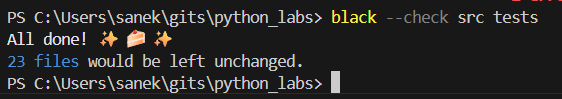


# Лабораторная работа 8
## models.py
```python
from dataclasses import dataclass, field
from datetime import datetime, date
from typing import Optional
import re

@dataclass
class Student:
    """Класс для представления студента с валидацией данных."""
    
    fio: str
    birthdate: str
    group: str
    gpa: float
    
    def __post_init__(self):
        """Валидация данных после инициализации объекта."""
        # Валидация формата даты
        try:
            datetime.strptime(self.birthdate, "%Y-%m-%d")
        except ValueError:
            raise ValueError(f"Неверный формат даты: {self.birthdate}. Ожидается YYYY-MM-DD")
        
        # Валидация диапазона GPA
        if not (0 <= self.gpa <= 5):
            raise ValueError(f"GPA должен быть в диапазоне от 0 до 5. Получено: {self.gpa}")
        
        # Валидация ФИО (должно содержать хотя бы пробел)
        if ' ' not in self.fio.strip():
            raise ValueError(f"ФИО должно содержать имя и фамилию. Получено: {self.fio}")
    
    def age(self) -> int:
        """
        Возвращает возраст студента в полных годах.
        
        Returns:
            int: Возраст студента
        """
        birth_date = datetime.strptime(self.birthdate, "%Y-%m-%d").date()
        today = date.today()
        
        age = today.year - birth_date.year
        
        # Проверяем, был ли уже день рождения в этом году
        if (today.month, today.day) < (birth_date.month, birth_date.day):
            age -= 1
            
        return age
    
    def to_dict(self) -> dict:
        """
        Сериализует объект Student в словарь.
        
        Returns:
            dict: Словарь с данными студента
        """
        return {
            "fio": self.fio,
            "birthdate": self.birthdate,
            "group": self.group,
            "gpa": self.gpa
        }
    
    @classmethod
    def from_dict(cls, data: dict) -> 'Student':
        """
        Десериализует словарь в объект Student.
        
        Args:
            data (dict): Словарь с данными студента
            
        Returns:
            Student: Объект Student
        """
        return cls(
            fio=data["fio"],
            birthdate=data["birthdate"],
            group=data["group"],
            gpa=data["gpa"]
        )
    
    def __str__(self) -> str:
        """
        Возвращает строковое представление студента.
        
        Returns:
            str: Строка с информацией о студенте
        """
        return f"{self.fio} ({self.group}), GPA: {self.gpa:.2f}, возраст: {self.age()} лет"
    
    @property
    def birth_year(self) -> int:
        """Возвращает год рождения студента."""
        return int(self.birthdate.split('-')[0])
```
## serialize.py
```python
import json
from pathlib import Path
from typing import List, Optional
from .models import Student

def students_to_json(students: List[Student], path: str) -> None:
    """
    Сохраняет список студентов в JSON файл.
    
    Args:
        students (List[Student]): Список объектов Student
        path (str): Путь к файлу для сохранения
        
    Raises:
        ValueError: Если передан не список или путь некорректен
    """
    if not isinstance(students, list):
        raise ValueError("Ожидается список объектов Student")
    
    if not all(isinstance(s, Student) for s in students):
        raise ValueError("Все элементы списка должны быть объектами Student")
    
    # Преобразуем студентов в словари
    data = [student.to_dict() for student in students]
    
    # Создаем директорию, если она не существует
    Path(path).parent.mkdir(parents=True, exist_ok=True)
    
    # Сохраняем в JSON
    with open(path, 'w', encoding='utf-8') as f:
        json.dump(data, f, ensure_ascii=False, indent=2)
    
    print(f"Данные успешно сохранены в {path}")

def students_from_json(path: str) -> List[Student]:
    """
    Загружает список студентов из JSON файла.
    
    Args:
        path (str): Путь к JSON файлу
        
    Returns:
        List[Student]: Список объектов Student
        
    Raises:
        FileNotFoundError: Если файл не найден
        ValueError: Если данные в файле некорректны
    """
    if not Path(path).exists():
        raise FileNotFoundError(f"Файл {path} не найден")
    
    try:
        with open(path, 'r', encoding='utf-8') as f:
            data = json.load(f)
    except json.JSONDecodeError as e:
        raise ValueError(f"Ошибка чтения JSON: {e}")
    
    if not isinstance(data, list):
        raise ValueError("Данные должны быть списком")
    
    students = []
    errors = []
    
    for i, item in enumerate(data):
        try:
            # Проверяем обязательные поля
            required_fields = ["fio", "birthdate", "group", "gpa"]
            for field in required_fields:
                if field not in item:
                    raise ValueError(f"Отсутствует обязательное поле: {field}")
            
            # Создаем студента
            student = Student.from_dict(item)
            students.append(student)
            
        except (ValueError, TypeError) as e:
            errors.append(f"Запись {i}: {e}")
    
    if errors:
        print("Обнаружены ошибки при загрузке:")
        for error in errors:
            print(f"  - {error}")
    
    print(f"Загружено {len(students)} студентов из {path}")
    return students
```
## lab08_main.py
```python
from src.lab08.models import Student
from src.lab08.serialize import students_to_json, students_from_json
import sys

def main():
    """Основная функция для демонстрации работы."""
    
    print("=== Лабораторная работа 8: ООП в Python ===")
    print()
    
    # Создаем список студентов
    students = [
        Student(
            fio="Иванов Иван Иванович",
            birthdate="2000-05-15",
            group="SE-01",
            gpa=4.5
        ),
        Student(
            fio="Петрова Анна Сергеевна",
            birthdate="2001-08-22",
            group="CS-02",
            gpa=4.8
        ),
        Student(
            fio="Сидоров Алексей Петрович",
            birthdate="1999-12-03",
            group="AI-03",
            gpa=3.9
        )
    ]
    
    print("Создано студентов:", len(students))
    print()
    
    # Демонстрация методов
    print("Информация о студентах:")
    print("-" * 50)
    for i, student in enumerate(students, 1):
        print(f"{i}. {student}")
        print(f"   Год рождения: {student.birth_year}")
        print(f"   Словарь: {student.to_dict()}")
        print()
    
    # Сохраняем в JSON
    output_path = "data/lab08/students_output.json"
    try:
        students_to_json(students, output_path)
        print(f"Данные сохранены в: {output_path}")
    except Exception as e:
        print(f"Ошибка сохранения: {e}")
        sys.exit(1)
    
    print()
    
    # Загружаем из JSON
    try:
        loaded_students = students_from_json(output_path)
        print(f"Загружено студентов: {len(loaded_students)}")
        
        print()
        print("Загруженные студенты:")
        print("-" * 50)
        for i, student in enumerate(loaded_students, 1):
            print(f"{i}. {student}")
            
    except Exception as e:
        print(f"Ошибка загрузки: {e}")
        sys.exit(1)
    
    print()
    
    # Демонстрация валидации
    print("Тестирование валидации:")
    print("-" * 50)
    
    try:
        # Неверный формат даты
        Student(fio="Тестовый Студент", birthdate="15-05-2000", group="TEST", gpa=4.0)
        print("ОШИБКА: Должна быть вызвана ошибка валидации даты")
    except ValueError as e:
        print(f"✓ Корректно обработана ошибка даты: {e}")
    
    try:
        # GPA вне диапазона
        Student(fio="Тестовый Студент", birthdate="2000-05-15", group="TEST", gpa=6.0)
        print("ОШИБКА: Должна быть вызвана ошибка валидации GPA")
    except ValueError as e:
        print(f"✓ Корректно обработана ошибка GPA: {e}")
    
    try:
        # Неполное ФИО
        Student(fio="Иванов", birthdate="2000-05-15", group="TEST", gpa=4.0)
        print("ОШИБКА: Должна быть вызвана ошибка валидации ФИО")
    except ValueError as e:
        print(f"✓ Корректно обработана ошибка ФИО: {e}")
    
    print()
    print("=== Работа завершена успешно ===")

if __name__ == "__main__":
    main()
```


# Лабораторная работа 9
## group.py
```python
"""
Класс Group - реализация CRUD-операций над студентами в CSV-файле
"""

import csv
from pathlib import Path
from typing import List, Optional, Dict, Any
import statistics

# Абсолютный импорт
import sys
import os

# Добавляем путь к src в sys.path
sys.path.insert(0, os.path.join(os.path.dirname(__file__), '..'))

from lab08.models import Student


class Group:
    """Класс для управления коллекцией студентов в CSV-файле."""
    
    CSV_HEADER = ["fio", "birthdate", "group", "gpa"]
    
    def __init__(self, storage_path: str):
        """
        Инициализация группы студентов.
        
        Args:
            storage_path (str): Путь к CSV-файлу для хранения данных
        """
        self.path = Path(storage_path)
        self._ensure_storage_exists()
    
    
    def _ensure_storage_exists(self) -> None:
        """
        Создает файл с заголовком, если он не существует.
        """
        if not self.path.exists():
            # Создаем директорию, если её нет
            self.path.parent.mkdir(parents=True, exist_ok=True)
            
            # Создаем файл с заголовком
            with open(self.path, 'w', encoding='utf-8', newline='') as f:
                writer = csv.DictWriter(f, fieldnames=self.CSV_HEADER)
                writer.writeheader()
            print(f"Создан новый файл: {self.path}")
    
    def _read_all_rows(self) -> List[Dict[str, str]]:
        """
        Читает все строки из CSV-файла.
        
        Returns:
            List[Dict[str, str]]: Список словарей с данными студентов
        
        Raises:
            ValueError: Если файл поврежден или имеет неверный формат
        """
        rows = []
        
        try:
            with open(self.path, 'r', encoding='utf-8', newline='') as f:
                reader = csv.DictReader(f)
                
                # Проверяем наличие заголовка
                if reader.fieldnames != self.CSV_HEADER:
                    raise ValueError(
                        f"Неверный формат CSV. Ожидаемые поля: {self.CSV_HEADER}, "
                        f"полученные: {reader.fieldnames}"
                    )
                
                for row_num, row in enumerate(reader, start=2):  # Начинаем с 2 (1 - заголовок)
                    try:
                        # Проверяем обязательные поля
                        for field in self.CSV_HEADER:
                            if field not in row:
                                raise ValueError(f"Отсутствует поле '{field}' в строке {row_num}")
                        
                        # Валидируем данные через создание объекта Student
                        Student(
                            fio=row['fio'],
                            birthdate=row['birthdate'],
                            group=row['group'],
                            gpa=float(row['gpa'])
                        )
                        
                        rows.append(row)
                        
                    except (ValueError, TypeError) as e:
                        print(f"Предупреждение: Пропущена строка {row_num}: {e}")
                        continue
                        
        except FileNotFoundError:
            print(f"Файл не найден: {self.path}")
            return []
        except Exception as e:
            raise ValueError(f"Ошибка чтения файла {self.path}: {e}")
        
        return rows
    
    def list(self) -> List[Student]:
        """
        Возвращает список всех студентов.
        
        Returns:
            List[Student]: Список объектов Student
        """
        rows = self._read_all_rows()
        students = []
        
        for row in rows:
            try:
                student = Student(
                    fio=row['fio'],
                    birthdate=row['birthdate'],
                    group=row['group'],
                    gpa=float(row['gpa'])
                )
                students.append(student)
            except (ValueError, TypeError) as e:
                print(f"Предупреждение: Не удалось создать студента из строки: {e}")
                continue
        
        return students
    
    def add(self, student: Student) -> None:
        """
        Добавляет нового студента в CSV-файл.
        
        Args:
            student (Student): Объект студента для добавления
        
        Raises:
            ValueError: Если студент с таким ФИО уже существует
        """
        # Проверяем, нет ли уже студента с таким ФИО
        existing_students = self.list()
        for existing in existing_students:
            if existing.fio == student.fio:
                raise ValueError(f"Студент с ФИО '{student.fio}' уже существует")
        
        # Добавляем новую запись
        with open(self.path, 'a', encoding='utf-8', newline='') as f:
            writer = csv.DictWriter(f, fieldnames=self.CSV_HEADER)
            writer.writerow({
                'fio': student.fio,
                'birthdate': student.birthdate,
                'group': student.group,
                'gpa': student.gpa
            })
        
        print(f"Добавлен студент: {student.fio}")
    
    def find(self, substr: str) -> List[Student]:
        """
        Ищет студентов по подстроке в ФИО.
        
        Args:
            substr (str): Подстрока для поиска в ФИО
        
        Returns:
            List[Student]: Список найденных студентов
        """
        if not substr:
            return []
        
        all_students = self.list()
        found_students = []
        
        for student in all_students:
            if substr.lower() in student.fio.lower():
                found_students.append(student)
        
        return found_students
    
    def remove(self, fio: str) -> bool:
        """
        Удаляет студента по ФИО.
        
        Args:
            fio (str): ФИО студента для удаления
        
        Returns:
            bool: True если студент был удален, False если не найден
        """
        rows = self._read_all_rows()
        initial_count = len(rows)
        
        # Фильтруем строки, оставляя только те, где ФИО не совпадает
        filtered_rows = [row for row in rows if row['fio'] != fio]
        
        if len(filtered_rows) == initial_count:
            print(f"Студент с ФИО '{fio}' не найден")
            return False
        
        # Записываем обновленные данные
        with open(self.path, 'w', encoding='utf-8', newline='') as f:
            writer = csv.DictWriter(f, fieldnames=self.CSV_HEADER)
            writer.writeheader()
            writer.writerows(filtered_rows)
        
        print(f"Удален студент: {fio}")
        return True
    
    def update(self, fio: str, **fields) -> bool:
        """
        Обновляет поля существующего студента.
        
        Args:
            fio (str): ФИО студента для обновления
            **fields: Поля для обновления (fio, birthdate, group, gpa)
        
        Returns:
            bool: True если студент был обновлен, False если не найден
        
        Raises:
            ValueError: Если переданы некорректные поля
        """
        # Проверяем допустимость полей
        valid_fields = set(self.CSV_HEADER)
        invalid_fields = set(fields.keys()) - valid_fields
        if invalid_fields:
            raise ValueError(f"Недопустимые поля: {invalid_fields}. Допустимые: {valid_fields}")
        
        rows = self._read_all_rows()
        updated = False
        
        for row in rows:
            if row['fio'] == fio:
                # Обновляем поля
                for key, value in fields.items():
                    row[key] = value
                
                # Валидируем обновленные данные
                try:
                    Student(
                        fio=row['fio'],
                        birthdate=row['birthdate'],
                        group=row['group'],
                        gpa=float(row['gpa'])
                    )
                except (ValueError, TypeError) as e:
                    raise ValueError(f"Некорректные данные для обновления: {e}")
                
                updated = True
                break
        
        if not updated:
            print(f"Студент с ФИО '{fio}' не найден")
            return False
        
        # Записываем обновленные данные
        with open(self.path, 'w', encoding='utf-8', newline='') as f:
            writer = csv.DictWriter(f, fieldnames=self.CSV_HEADER)
            writer.writeheader()
            writer.writerows(rows)
        
        print(f"Обновлен студент: {fio}")
        return True
    
    def stats(self) -> Dict[str, Any]:
        """
        Возвращает статистику по студентам.
        
        Returns:
            Dict[str, Any]: Словарь со статистикой
        
        Raises:
            ValueError: Если нет студентов для анализа
        """
        students = self.list()
        
        if not students:
            raise ValueError("Нет студентов для анализа")
        
        # Собираем GPA для вычислений
        gpa_list = [student.gpa for student in students]
        
        # Группируем по группам
        groups_count = {}
        for student in students:
            group = student.group
            groups_count[group] = groups_count.get(group, 0) + 1
        
        # Топ-5 студентов по GPA
        sorted_students = sorted(students, key=lambda s: s.gpa, reverse=True)
        top_5 = [
            {"fio": s.fio, "gpa": s.gpa, "group": s.group}
            for s in sorted_students[:5]
        ]
        
        return {
            "count": len(students),
            "min_gpa": min(gpa_list),
            "max_gpa": max(gpa_list),
            "avg_gpa": statistics.mean(gpa_list) if gpa_list else 0,
            "median_gpa": statistics.median(gpa_list) if gpa_list else 0,
            "groups": groups_count,
            "top_5_students": top_5,
            "age_distribution": {
                "youngest": min(students, key=lambda s: s.age()).age(),
                "oldest": max(students, key=lambda s: s.age()).age(),
                "avg_age": statistics.mean([s.age() for s in students])
            }
        }
    
    def clear(self) -> None:
        """
        Очищает все записи студентов, оставляя только заголовок.
        """
        with open(self.path, 'w', encoding='utf-8', newline='') as f:
            writer = csv.DictWriter(f, fieldnames=self.CSV_HEADER)
            writer.writeheader()
        
        print(f"База данных очищена: {self.path}")
    
    def import_from_json(self, json_path: str) -> int:
        """
        Импортирует студентов из JSON файла.
        
        Args:
            json_path (str): Путь к JSON файлу
        
        Returns:
            int: Количество импортированных студентов
        """
        from ..lab08.serialize import students_from_json
        
        imported_students = students_from_json(json_path)
        imported_count = 0
        
        for student in imported_students:
            try:
                self.add(student)
                imported_count += 1
            except ValueError as e:
                print(f"Не удалось импортировать {student.fio}: {e}")
        
        print(f"Импортировано {imported_count} студентов из {json_path}")
        return imported_count
    
    def export_to_json(self, json_path: str) -> None:
        """
        Экспортирует студентов в JSON файл.
        
        Args:
            json_path (str): Путь для сохранения JSON файла
        """
        from ..lab08.serialize import students_to_json
        
        students = self.list()
        students_to_json(students, json_path)
        print(f"Экспортировано {len(students)} студентов в {json_path}")
    
    def __len__(self) -> int:
        """
        Возвращает количество студентов в группе.
        
        Returns:
            int: Количество студентов
        """
        return len(self.list())
    
    def __str__(self) -> str:
        """
        Строковое представление группы.
        
        Returns:
            str: Информация о группе
        """
        students = self.list()
        return f"Группа (файл: {self.path}): {len(students)} студентов"
```
## __init__.py
```python
"""
Пакет lab09 - База данных на CSV с CRUD-операциями
"""

from .group import Group

__all__ = ['Group']
__version__ = '1.0.0'
```
## lab09_demo.py
```python
#!/usr/bin/env python3
"""
Демонстрационный скрипт для ЛР9 - Класс Group и CRUD операции
"""

import sys
import os

# Добавляем путь для импорта
sys.path.insert(0, os.path.join(os.path.dirname(__file__), 'src'))

from lab08.models import Student
from lab09.group import Group


def demonstrate_crud_operations():
    """Демонстрация CRUD операций."""
    print("="*60)
    print("ДЕМОНСТРАЦИЯ CRUD ОПЕРАЦИЙ")
    print("="*60)
    
    # Создаем группу студентов
    csv_path = "data/lab09/students.csv"
    group = Group(csv_path)
    
    print(f"\n1. Инициализация группы:")
    print(f"   Файл: {csv_path}")
    print(f"   Студентов в базе: {len(group)}")
    
    print(f"\n2. Вывод всех студентов:")
    print("-" * 70)
    students = group.list()
    for i, student in enumerate(students, 1):
        print(f"{i:2}. {student}")
    print("-" * 70)
    
    print(f"\n3. Добавление нового студента:")
    new_student = Student(
        fio="Новиков Павел Сергеевич",
        birthdate="2001-04-18",
        group="SE-03",
        gpa=4.1
    )
    try:
        group.add(new_student)
        print(f"   Добавлен: {new_student}")
    except ValueError as e:
        print(f"   Ошибка: {e}")
    
    print(f"\n4. Поиск студентов (подстрока 'Петр'):")
    found = group.find("Петр")
    for i, student in enumerate(found, 1):
        print(f"   {i}. {student}")
    
    print(f"\n5. Обновление студента:")
    try:
        if group.update("Иванов Иван Иванович", gpa=4.7, group="SE-01A"):
            print("   GPA Иванова Ивана обновлен до 4.7")
            print("   Группа изменена на SE-01A")
    except ValueError as e:
        print(f"   Ошибка обновления: {e}")
    
    print(f"\n6. Статистика по группе:")
    try:
        stats = group.stats()
        print(f"   Всего студентов: {stats['count']}")
        print(f"   Минимальный GPA: {stats['min_gpa']:.2f}")
        print(f"   Максимальный GPA: {stats['max_gpa']:.2f}")
        print(f"   Средний GPA: {stats['avg_gpa']:.2f}")
        print(f"   Распределение по группам:")
        for group_name, count in stats['groups'].items():
            print(f"     - {group_name}: {count} студентов")
        print(f"   Топ-5 студентов:")
        for i, top_student in enumerate(stats['top_5_students'], 1):
            print(f"     {i}. {top_student['fio']} (GPA: {top_student['gpa']:.2f})")
    except ValueError as e:
        print(f"   Ошибка статистики: {e}")
    
    print(f"\n7. Удаление студента:")
    if group.remove("Сидоров Алексей Петрович"):
        print("   Сидоров Алексей удален")
    else:
        print("   Студент не найден")
    
    print(f"\n8. Финальный список студентов:")
    print("-" * 70)
    final_students = group.list()
    for i, student in enumerate(final_students, 1):
        print(f"{i:2}. {student}")
    print("-" * 70)
    print(f"   Всего студентов: {len(final_students)}")


def demonstrate_error_handling():
    """Демонстрация обработки ошибок."""
    print("\n" + "="*60)
    print("ДЕМОНСТРАЦИЯ ОБРАБОТКИ ОШИБОК")
    print("="*60)
    
    # Создаем тестовую группу
    test_csv = "data/lab09/test_students.csv"
    group = Group(test_csv)
    
    print("\n1. Попытка добавить студента с существующим ФИО:")
    student1 = Student(
        fio="Дубль Тест Тестович",
        birthdate="2000-01-01",
        group="TEST-01",
        gpa=4.0
    )
    student2 = Student(
        fio="Дубль Тест Тестович",  # То же ФИО!
        birthdate="2001-02-02",
        group="TEST-02",
        gpa=3.5
    )
    
    try:
        group.add(student1)
        print("   Первый студент добавлен успешно")
    except ValueError as e:
        print(f"   Ошибка: {e}")
    
    try:
        group.add(student2)
        print("   Второй студент добавлен успешно")
    except ValueError as e:
        print(f"   Ошибка при добавлении дубля: {e}")
    
    print("\n2. Попытка обновления несуществующего студента:")
    if not group.update("Несуществующий Студент", gpa=5.0):
        print("   Корректно: студент не найден для обновления")
    
    print("\n3. Попытка обновления с некорректными данными:")
    try:
        group.update("Дубль Тест Тестович", gpa=6.0)  # GPA > 5
        print("   ОШИБКА: Должна быть вызвана ошибка валидации")
    except ValueError as e:
        print(f"   Корректно: {e}")
    
    print("\n4. Попытка удаления несуществующего студента:")
    if not group.remove("Нет Такого Студента"):
        print("   Корректно: студент не найден для удаления")
    
    # Удаляем тестовый файл
    import os
    if os.path.exists(test_csv):
        os.remove(test_csv)
        print(f"\n   Тестовый файл удален: {test_csv}")


def demonstrate_import_export():
    """Демонстрация импорта/экспорта."""
    print("\n" + "="*60)
    print("ДЕМОНСТРАЦИЯ ИМПОРТА/ЭКСПОРТА")
    print("="*60)
    
    # Создаем тестовую группу
    test_csv = "data/lab09/import_export_test.csv"
    group = Group(test_csv)
    
    print("\n1. Импорт из JSON (данные из ЛР8):")
    json_path = "data/lab08/students_output.json"
    if os.path.exists(json_path):
        imported_count = group.import_from_json(json_path)
        print(f"   Импортировано студентов: {imported_count}")
    else:
        print(f"   JSON файл не найден: {json_path}")
        print("   Создаем тестовых студентов...")
        # Создаем несколько тестовых студентов
        test_students = [
            Student("Импортный Студент 1", "2000-01-01", "IMP-01", 4.0),
            Student("Импортный Студент 2", "2001-02-02", "IMP-02", 4.5),
            Student("Импортный Студент 3", "2002-03-03", "IMP-03", 3.8),
        ]
        for student in test_students:
            try:
                group.add(student)
            except ValueError:
                pass
    
    print("\n2. Экспорт в JSON:")
    export_path = "data/lab09/exported_students.json"
    group.export_to_json(export_path)
    if os.path.exists(export_path):
        file_size = os.path.getsize(export_path)
        print(f"   Экспортировано в: {export_path}")
        print(f"   Размер файла: {file_size} байт")
    
    print("\n3. Очистка базы данных:")
    group.clear()
    print(f"   Студентов после очистки: {len(group)}")
    
    # Удаляем тестовые файлы
    if os.path.exists(test_csv):
        os.remove(test_csv)
    if os.path.exists(export_path):
        os.remove(export_path)
    print(f"   Тестовые файлы удалены")


def main():
    """Основная функция."""
    print("="*60)
    print("ЛАБОРАТОРНАЯ РАБОТА 9: База данных на CSV")
    print("Класс Group, CRUD-операции")
    print("="*60)
    
    # Создаем директории для данных
    os.makedirs("data/lab09", exist_ok=True)
    
    # Демонстрируем различные аспекты
    demonstrate_crud_operations()
    demonstrate_error_handling()
    demonstrate_import_export()
    
    print("\n" + "="*60)
    print("ВСЕ ТЕСТЫ ЗАВЕРШЕНЫ УСПЕШНО!")
    print("="*60)


if __name__ == "__main__":
    try:
        main()
    except KeyboardInterrupt:
        print("\n\nПрограмма прервана пользователем.")
        sys.exit(1)
    except Exception as e:
        print(f"\nНеожиданная ошибка: {e}")
        import traceback
        traceback.print_exc()
        sys.exit(1)
```


# Лабораторная работа 10
## structures.py
```python
from collections import deque
from typing import Any


class Stack:
    """Реализация стека (LIFO) на базе списка."""
    
    def __init__(self) -> None:
        """Инициализация пустого стека."""
        self._data: list[Any] = []
    
    def push(self, item: Any) -> None:
        """Добавить элемент на вершину стека. Сложность: O(1)."""
        self._data.append(item)
    
    def pop(self) -> Any:
        """
        Удалить и вернуть верхний элемент стека.
        Сложность: O(1).
        
        Raises:
            IndexError: если стек пуст
        """
        if self.is_empty():
            raise IndexError("Попытка извлечения из пустого стека")
        return self._data.pop()
    
    def peek(self) -> Any | None:
        """
        Вернуть верхний элемент без удаления.
        Сложность: O(1).
        
        Returns:
            Верхний элемент или None, если стек пуст
        """
        if self.is_empty():
            return None
        return self._data[-1]
    
    def is_empty(self) -> bool:
        """Проверить, пуст ли стек. Сложность: O(1)."""
        return len(self._data) == 0
    
    def __len__(self) -> int:
        """Вернуть количество элементов в стеке. Сложность: O(1)."""
        return len(self._data)
    
    def __repr__(self) -> str:
        """Строковое представление стека."""
        return f"Stack({self._data})"


class Queue:
    """Реализация очереди (FIFO) на базе deque."""
    
    def __init__(self) -> None:
        """Инициализация пустой очереди."""
        self._data: deque[Any] = deque()
    
    def enqueue(self, item: Any) -> None:
        """Добавить элемент в конец очереди. Сложность: O(1)."""
        self._data.append(item)
    
    def dequeue(self) -> Any:
        """
        Удалить и вернуть первый элемент очереди.
        Сложность: O(1).
        
        Raises:
            IndexError: если очередь пуста
        """
        if self.is_empty():
            raise IndexError("Попытка извлечения из пустой очереди")
        return self._data.popleft()
    
    def peek(self) -> Any | None:
        """
        Вернуть первый элемент без удаления.
        Сложность: O(1).
        
        Returns:
            Первый элемент или None, если очередь пуста
        """
        if self.is_empty():
            return None
        return self._data[0]
    
    def is_empty(self) -> bool:
        """Проверить, пуста ли очередь. Сложность: O(1)."""
        return len(self._data) == 0
    
    def __len__(self) -> int:
        """Вернуть количество элементов в очереди. Сложность: O(1)."""
        return len(self._data)
    
    def __repr__(self) -> str:
        """Строковое представление очереди."""
        return f"Queue({list(self._data)})"
```
## linked_list.py
```python
from typing import Any, Iterator, Optional


class Node:
    """Узел односвязного списка."""
    
    def __init__(self, value: Any, next_node: Optional['Node'] = None) -> None:
        """
        Инициализация узла.
        
        Args:
            value: Значение узла
            next_node: Ссылка на следующий узел
        """
        self.value: Any = value
        self.next: Optional[Node] = next_node
    
    def __repr__(self) -> str:
        """Строковое представление узла."""
        return f"[{self.value}]"


class SinglyLinkedList:
    """Односвязный список."""
    
    def __init__(self) -> None:
        """Инициализация пустого списка."""
        self.head: Optional[Node] = None
        self.tail: Optional[Node] = None
        self._size: int = 0
    
    def append(self, value: Any) -> None:
        """
        Добавить элемент в конец списка.
        Сложность: O(1) с использованием tail.
        """
        new_node = Node(value)
        
        if self.is_empty():
            # Если список пуст, новый узел становится и головой и хвостом
            self.head = new_node
            self.tail = new_node
        else:
            # Добавляем в конец и обновляем tail
            self.tail.next = new_node
            self.tail = new_node
        
        self._size += 1
    
    def prepend(self, value: Any) -> None:
        """
        Добавить элемент в начало списка.
        Сложность: O(1).
        """
        new_node = Node(value, self.head)
        
        if self.is_empty():
            # Если список пуст, новый узел становится и головой и хвостом
            self.tail = new_node
        
        self.head = new_node
        self._size += 1
    
    def insert(self, idx: int, value: Any) -> None:
        """
        Вставить элемент по индексу.
        Сложность: O(n) в худшем случае.
        
        Args:
            idx: Индекс для вставки
            value: Значение для вставки
            
        Raises:
            IndexError: если индекс вне диапазона [0, len(list)]
        """
        if idx < 0 or idx > self._size:
            raise IndexError(f"Индекс {idx} вне диапазона [0, {self._size}]")
        
        if idx == 0:
            # Вставка в начало
            self.prepend(value)
        elif idx == self._size:
            # Вставка в конец
            self.append(value)
        else:
            # Вставка в середину
            current = self.head
            for _ in range(idx - 1):
                current = current.next
            
            new_node = Node(value, current.next)
            current.next = new_node
            self._size += 1
    
    def remove_at(self, idx: int) -> None:
        """
        Удалить элемент по индексу.
        Сложность: O(n) в худшем случае.
        
        Args:
            idx: Индекс элемента для удаления
            
        Raises:
            IndexError: если индекс вне диапазона или список пуст
        """
        if self.is_empty():
            raise IndexError("Попытка удаления из пустого списка")
        
        if idx < 0 or idx >= self._size:
            raise IndexError(f"Индекс {idx} вне диапазона [0, {self._size - 1}]")
        
        if idx == 0:
            # Удаление первого элемента
            self.head = self.head.next
            if self.head is None:
                # Если список стал пустым, обновляем tail
                self.tail = None
        else:
            # Удаление из середины или конца
            current = self.head
            for _ in range(idx - 1):
                current = current.next
            
            # current теперь указывает на элемент перед удаляемым
            current.next = current.next.next
            
            # Если удалили последний элемент, обновляем tail
            if current.next is None:
                self.tail = current
        
        self._size -= 1
    
    def remove(self, value: Any) -> bool:
        """
        Удалить первое вхождение значения.
        Сложность: O(n).
        
        Args:
            value: Значение для удаления
            
        Returns:
            True если элемент был удален, иначе False
        """
        if self.is_empty():
            return False
        
        # Специальный случай: удаление головы
        if self.head.value == value:
            self.head = self.head.next
            if self.head is None:
                self.tail = None
            self._size -= 1
            return True
        
        # Поиск элемента для удаления
        current = self.head
        while current.next is not None and current.next.value != value:
            current = current.next
        
        # Если нашли элемент
        if current.next is not None:
            current.next = current.next.next
            
            # Если удалили последний элемент, обновляем tail
            if current.next is None:
                self.tail = current
            
            self._size -= 1
            return True
        
        return False
    
    def is_empty(self) -> bool:
        """Проверить, пуст ли список. Сложность: O(1)."""
        return self.head is None
    
    def __iter__(self) -> Iterator[Any]:
        """
        Итератор по значениям списка.
        Сложность итерации по всему списку: O(n).
        """
        current = self.head
        while current is not None:
            yield current.value
            current = current.next
    
    def __len__(self) -> int:
        """Вернуть количество элементов. Сложность: O(1)."""
        return self._size
    
    def __repr__(self) -> str:
        """Строковое представление списка в виде [A] -> [B] -> None."""
        if self.is_empty():
            return "SinglyLinkedList([])"
        
        result = []
        current = self.head
        while current is not None:
            result.append(str(current))
            current = current.next
        
        return " -> ".join(result) + " -> None"
    
    def to_list(self) -> list:
        """Преобразовать список в обычный Python list. Сложность: O(n)."""
        return list(self)
```
## example_usage.py
```python
import sys
import os
sys.path.append(os.path.dirname(os.path.dirname(os.path.abspath(__file__))))

from src.lab10.structures import Stack, Queue
from src.lab10.linked_list import SinglyLinkedList


def demonstrate_stack():
    """Демонстрация работы стека."""
    print("=" * 50)
    print("Демонстрация стека (Stack):")
    print("=" * 50)
    
    stack = Stack()
    print(f"Создан пустой стек: {stack}")
    print(f"Стек пуст? {stack.is_empty()}")
    
    # Добавляем элементы
    for i in range(1, 6):
        stack.push(f"Элемент {i}")
        print(f"push('Элемент {i}') -> {stack}")
    
    print(f"\nВерхний элемент (peek): {stack.peek()}")
    print(f"Длина стека: {len(stack)}")
    
    # Извлекаем элементы
    print("\nИзвлечение элементов:")
    while not stack.is_empty():
        print(f"pop() -> {stack.pop()}, стек: {stack}")
    
    print(f"\nСтек пуст? {stack.is_empty()}")


def demonstrate_queue():
    """Демонстрация работы очереди."""
    print("\n" + "=" * 50)
    print("Демонстрация очереди (Queue):")
    print("=" * 50)
    
    queue = Queue()
    print(f"Создана пустая очередь: {queue}")
    print(f"Очередь пуста? {queue.is_empty()}")
    
    # Добавляем элементы
    for i in range(1, 6):
        queue.enqueue(f"Задача {i}")
        print(f"enqueue('Задача {i}') -> {queue}")
    
    print(f"\nПервый элемент (peek): {queue.peek()}")
    print(f"Длина очереди: {len(queue)}")
    
    # Извлекаем элементы
    print("\nИзвлечение элементов:")
    while not queue.is_empty():
        print(f"dequeue() -> {queue.dequeue()}, очередь: {queue}")
    
    print(f"\nОчередь пуста? {queue.is_empty()}")


def demonstrate_linked_list():
    """Демонстрация работы односвязного списка."""
    print("\n" + "=" * 50)
    print("Демонстрация односвязного списка (SinglyLinkedList):")
    print("=" * 50)
    
    lst = SinglyLinkedList()
    print(f"Создан пустой список: {lst}")
    print(f"Список пуст? {lst.is_empty()}")
    
    # Добавляем элементы в конец
    print("\nДобавление в конец (append):")
    for i in range(1, 4):
        lst.append(i * 10)
        print(f"append({i * 10}) -> {lst}")
    
    # Добавляем элементы в начало
    print("\nДобавление в начало (prepend):")
    lst.prepend(5)
    print(f"prepend(5) -> {lst}")
    lst.prepend(1)
    print(f"prepend(1) -> {lst}")
    
    # Вставка по индексу
    print("\nВставка по индексу (insert):")
    lst.insert(2, 15)
    print(f"insert(2, 15) -> {lst}")
    lst.insert(0, 0)
    print(f"insert(0, 0) -> {lst}")
    lst.insert(len(lst), 40)
    print(f"insert({len(lst)-1}, 40) -> {lst}")
    
    # Итерация по списку
    print(f"\nИтерация по списку:")
    print(f"Список как Python list: {lst.to_list()}")
    
    # Удаление по индексу
    print("\nУдаление по индексу (remove_at):")
    lst.remove_at(2)
    print(f"remove_at(2) -> {lst}")
    lst.remove_at(0)
    print(f"remove_at(0) -> {lst}")
    
    # Удаление по значению
    print("\nУдаление по значению (remove):")
    print(f"remove(30): {lst.remove(30)} -> {lst}")
    print(f"remove(99) (не существует): {lst.remove(99)} -> {lst}")
    
    print(f"\nИтоговый список: {lst}")
    print(f"Длина списка: {len(lst)}")
    print(f"Список как Python list: {lst.to_list()}")


def benchmark_comparison():
    """Сравнение производительности структур данных."""
    print("\n" + "=" * 50)
    print("Сравнение производительности:")
    print("=" * 50)
    
    import time
    import random
    
    test_size = 10000
    
    # Тестирование Stack
    print(f"\nТестирование Stack ({test_size} операций):")
    stack = Stack()
    start = time.time()
    
    for i in range(test_size):
        stack.push(i)
    
    for _ in range(test_size):
        stack.pop()
    
    stack_time = time.time() - start
    print(f"Время выполнения: {stack_time:.6f} секунд")
    
    # Тестирование Queue
    print(f"\nТестирование Queue ({test_size} операций):")
    queue = Queue()
    start = time.time()
    
    for i in range(test_size):
        queue.enqueue(i)
    
    for _ in range(test_size):
        queue.dequeue()
    
    queue_time = time.time() - start
    print(f"Время выполнения: {queue_time:.6f} секунд")
    
    # Тестирование SinglyLinkedList
    print(f"\nТестирование SinglyLinkedList ({test_size} операций):")
    lst = SinglyLinkedList()
    start = time.time()
    
    for i in range(test_size):
        lst.append(i)
    
    # Обратите внимание: удаление из начала связного списка медленное!
    for _ in range(test_size):
        lst.remove_at(0)
    
    linked_list_time = time.time() - start
    print(f"Время выполнения: {linked_list_time:.6f} секунд")
    
    # Вывод сравнения
    print(f"\n" + "=" * 50)
    print("Результаты сравнения:")
    print(f"Stack:    {stack_time:.6f} секунд")
    print(f"Queue:    {queue_time:.6f} секунд")
    print(f"LinkedList: {linked_list_time:.6f} секунд")
    print(f"\nLinkedList медленнее Stack в {linked_list_time/stack_time:.1f} раз")
    print(f"LinkedList медленнее Queue в {linked_list_time/queue_time:.1f} раз")


if __name__ == "__main__":
    demonstrate_stack()
    demonstrate_queue()
    demonstrate_linked_list()
    benchmark_comparison()
```


